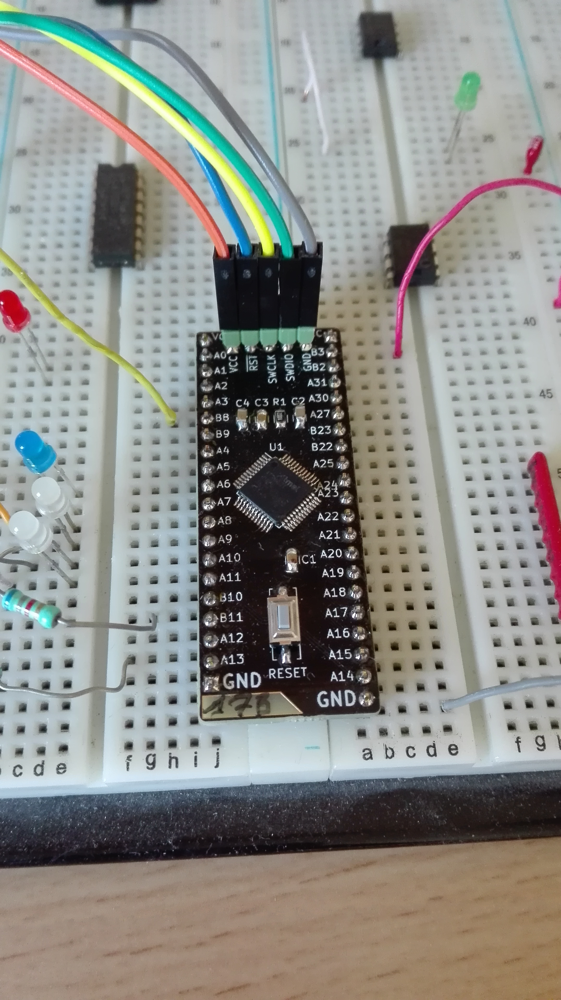

# ATSAML21G_Breakout
Breakout board for ATSAML21Gxx MCU

Bill of materials (BOM):

|  Designator  | Value |  Package description |
|     :---:      |     :---:      |     :---:      |
|R1 | 10k | 0805 |
|C1 | 100nF | 0805 |
|C2 | 1µF | 0805 |
|C3 | 100nF | 0805 |
|C4 | 1µF | 0805 |
|J1 | 21 pins | 0.1"/2.54mm header |
|J2 | 20 pins | 0.1"/2.54mm header |
|J3 | 5 pins | 0.1"/2.54mm header - JTAG connector |
|SW1 | K2-1107ST | Switch from LCSC.com |
|U1 | ATSAML21Gxx | MCU in LQFP48 package |

Here is the board once assembled:

